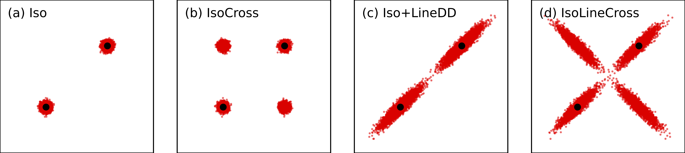

# IsoLineCross Variation

This repository contains the code for the paper **"Discrete Gene Crossover Accelerates Solution Discovery in Quality-Diversity Algorithms"** by Joshua L. Hutchinson, J. Michael Herrmann, and Simón C. Smith.

[](https://arxiv.org/abs/2602.13730)


## Overview

Quality-Diversity (QD) variation operators often rely on gradual, incremental variation operators (such as Isotropic Gaussian noise or LineDD) and thus struggle to efficiently propagate beneficial genetic "building blocks" across large populations or explore regions distant from parent solutions.

**Our Solution:** Mirroring the biological principle of meiosis, we augment standard variation-based QD operators with **discrete, gene-level crossover**. This mechanism enables rapid recombination of elite genetic material and forces the exploration of novel genotype configurations beyond the existing elite hypervolume.

<div align="center">
  <!-- Replace 'assets/crossover_demo.png' with the actual path to your saved image -->
  
  <br>
  <i>Simulation of the variation operators used in the paper. IsoLineCross, as shown in (d), provides a perpendicular exploration to the existing hypervolume.</i>
</div>


## The Operators

This repository implements two novel variation operators, designed as extensions to the QDax framework:

*   **`IsoCross`**: Combines standard Isotropic Gaussian mutation with our discrete crossover mechanism.
*   **`IsoLineCross`**: Augments the standard Iso+LineDD operator with discrete crossover. This provides a complementary exploration mechanism that successfully sustains quality-diversity growth, especially in later stages of optimization.


## Repository Structure

*   **`cross_mutation_operators.py`**: The core implementation of the discrete crossover mutation operators (`IsoLineCross`).
*   **`main_iso.py`**: CVT-MAP-Elites optimization loop using baseline Isotropic Gaussian mutation.
*   **`main_isoline.py`**: Optimization loop using baseline Iso + LineDD mutation.
*   **`main_isocross.py`**: Optimization loop using the `IsoCross` operator.
*   **`main_isolinecross.py`**: Optimization loop using our top-performing `IsoLineCross` operator.
*   **`run_experiments.sh`**: Script for running sample results using each operator.
*   **`configs/` & `analysis/`**: Configurations for the environments and scripts to analyze archive metrics.


## Quick Start

1.  **Clone this repository:**
    ```bash
    git clone [https://github.com/JoshuaLHutchinson/hutchinson_2026_gecco.git](https://github.com/JoshuaLHutchinson/hutchinson_2026_gecco.git)
    cd hutchinson_2026_gecco
    ```

2.  **Install dependencies:**
    ```bash
    pip install -r requirements.txt
    ```

3.  **Run an experiment** (e.g., with the IsoLineCross operator):
    ```bash
    run_experiments.sh
    ```


## Citation

If you find this code or research useful, please consider citing the paper:

```bibtex
@article{hutchinson2026discrete,
      title={Discrete Gene Crossover Accelerates Solution Discovery in Quality-Diversity Algorithms}, 
      author={Joshua L Hutchinson and J. Michael Herrmann and Simón C. Smith},
      year={2026},
      journal={arXiv preprint arXiv:2602.13730},
      eprint={2602.13730},
      archivePrefix={arXiv},
      primaryClass={cs.NE}
}